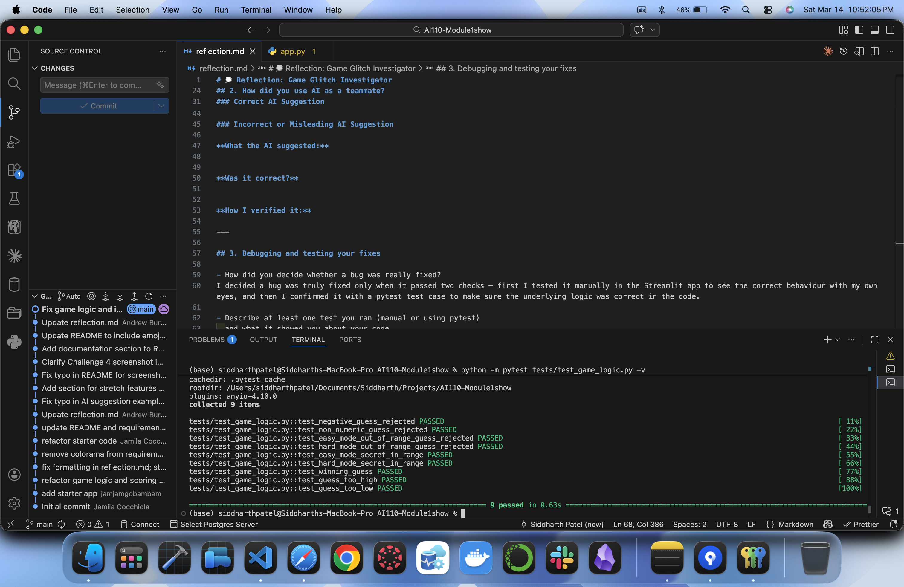
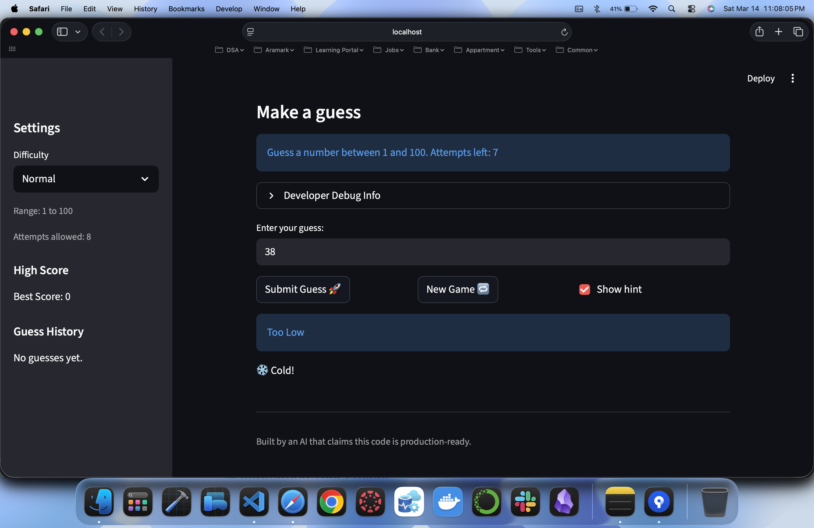
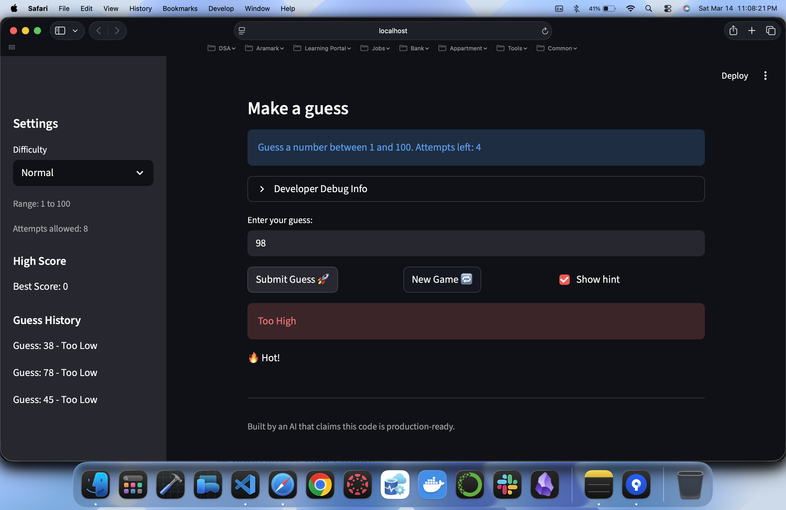

# 🎮 Game Glitch Investigator: The Impossible Guesser

## 🚨 The Situation

You asked an AI to build a simple "Number Guessing Game" using Streamlit.
It wrote the code, ran away, and now the game is unplayable. 

- You can't win.
- The hints lie to you.
- The secret number seems to have commitment issues.

## 🛠️ Setup

1. Install dependencies: `pip install -r requirements.txt`
2. Run the broken app: `python -m streamlit run app.py`

## 🕵️‍♂️ Your Mission

1. **Play the game.** Open the "Developer Debug Info" tab in the app to see the secret number. Try to win.
2. **Find the State Bug.** Why does the secret number change every time you click "Submit"? Ask ChatGPT: *"How do I keep a variable from resetting in Streamlit when I click a button?"*
3. **Fix the Logic.** The hints ("Higher/Lower") are wrong. Fix them.
4. **Refactor & Test.** - Move the logic into `logic_utils.py`.
   - Run `pytest` in your terminal.
   - Keep fixing until all tests pass!

## 📝 Document Your Experience

- [ ] Describe the game's purpose.
This is a number guessing game built with Streamlit. The player selects a difficulty level and tries to guess a randomly generated secret number within the valid range. The game provides hints after each guess ("Too High" or "Too Low") and tracks the player's score and number of attempts.

Easy mode: Guess a number between 1 and 20
Hard mode: Guess a number between 1 and 50

- [ ] Detail which bugs you found.
Secret number out of range — Easy mode generated numbers like 82 (should be 1–20). Hard mode generated numbers like 57 (should be 1–50).
New Game button not resetting — Clicking "New Game" did nothing. The game did not reset and no new secret number was generated.
Input accepted negative values — The input field allowed values like -1 which should never be a valid guess.
Input accepted non-numeric characters — Letters and symbols could be typed into the input field.
Input accepted out-of-range values — In Hard mode, values like 58 were accepted even though the valid range is 1–50.

- [ ] Explain what fixes you applied.
Secret number out of range — Fixed the secret number generation to always stay within the valid range for the selected difficulty level.
New Game button — Fixed the reset logic so clicking "New Game" clears all values (guesses, score, attempts, hints) and generates a new secret number. Also fixed a Streamlit session state error that occurred when switching difficulty and clicking New Game.
Negative values — Added validation in logic_utils.py to reject any value below 1.
Non-numeric characters — Added input validation to reject any non-numeric input.
Out-of-range values — Added range validation so only numbers within the valid range for the selected difficulty are accepted.
Refactored code — Moved check_guess from app.py into logic_utils.py to separate game logic from UI code.

## 📸 Demo

## 🚀 Stretch Features

- 
- 
